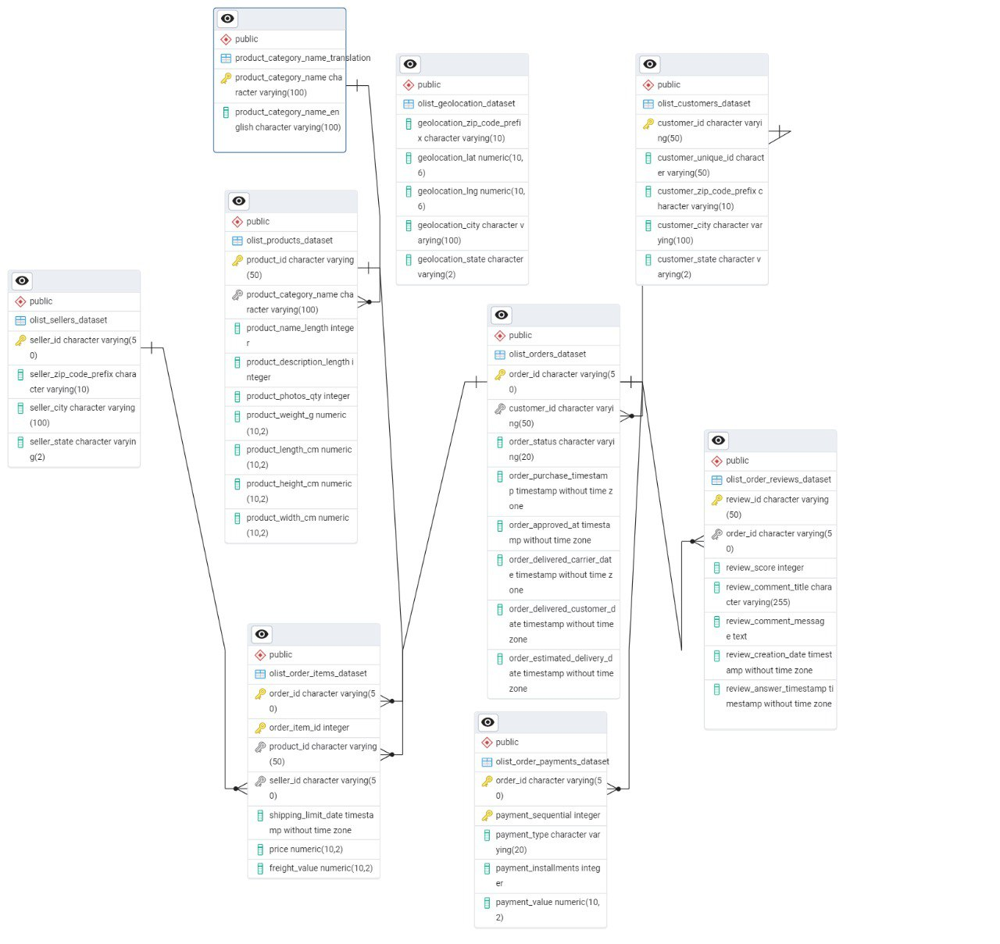

# Магазин: Kadyr

Этот проект демонстрирует, как можно подключиться к базе данных интернет-магазина, выполнять запросы и анализировать информацию о заказах, товарах и клиентах с помощью **pandas**.

## Структура проекта

```
.
├── db.py          # Подключение к базе данных магазина
├── main.py        # Запуск и выполнение SQL-запросов
├── queries.sql    # Запросы для анализа данных магазина
├── .env           # Настройки подключения к БД
├── requirements.txt
└── README.md
```

## Установка

1. Клонировать репозиторий:

```bash
git clone <URL>
cd <папка_проекта>
```

2. Создать виртуальное окружение и активировать его:

```bash
python -m venv venv
venv\Scripts\activate   # Windows
source venv/bin/activate  # Linux/Mac
```

3. Установить зависимости:

```bash
pip install -r requirements.txt
```

## Настройка

Создайте файл `.env` в корне проекта и добавьте настройки подключения к базе данных магазина:

```
DB_NAME=shop_db
DB_USER=shop_user
DB_PASS=shop_password
DB_HOST=localhost
DB_PORT=5432
```

## Использование

1. В `queries.sql` можно хранить любые аналитические запросы.
   Например, подсчёт заказов, популярные товары или статистику по категориям.
   Каждый запрос должен заканчиваться точкой с запятой `;`.

Пример `queries.sql`:

```sql
-- Версия сервера
SELECT version();

-- Количество заказов по статусам
SELECT order_status, COUNT(*) 
FROM olist_orders 
GROUP BY order_status;

-- Топ-5 популярных товаров
SELECT product_id, COUNT(*) AS sales_count
FROM olist_order_items
GROUP BY product_id
ORDER BY sales_count DESC
LIMIT 5;
```

2. Запустите скрипт:

```bash
python main.py
```

3. Результаты будут показаны в консоли в виде таблиц `pandas.DataFrame`.

## Зависимости

* Python 3.9+
* pandas
* SQLAlchemy
* psycopg2
* python-dotenv

Установить можно командой:

```bash
pip install pandas sqlalchemy psycopg2-binary python-dotenv
```

---

✅ Теперь вы можете централизованно хранить SQL-запросы для магазина и быстро получать аналитику о продажах, товарах и клиентах.
